#  “知否”——问答型的知识分享网站web

 

##  关于“知否” 

 - **2019年6月软件工程专业实训项目**
 - **网站原型：参照了“知乎”，“简书”，等同类型的知识分享网站；**
 - **网页的UI进行系统设计，注重更好的交互体验；**
 - **使用场景：知识提问回答，写文章，分类搜索等；**

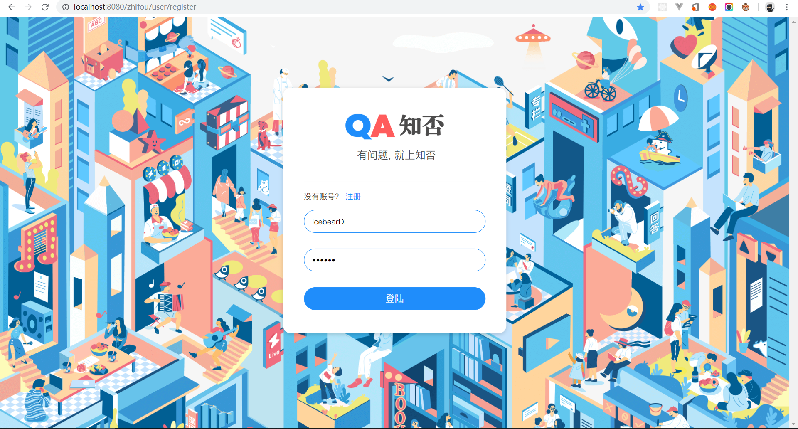

## 技术栈

 - **一个 java web 应用**
 - **后端框架SpringBoot MVC，数据库Mysql，使用JPA**
 - **前端HTML，CSS，JavaScript，引入了Bootstrap，jQuery**

## UI设计

- **红，蓝为主配色**
- **圆角设计，让界面更具有亲和力**
- **使用了卡片设计，模块分明，阅读更清晰**
- **整体设计简介，现代，和年轻化**

## 关于作者

热爱前端的菜鸟，喜欢设计，熟练使用ps等软件，“知否”的设计全部由我自己设计完成，使用psd底稿，再进行知否的前端编码，前端所有代码交互由我独立完成，配合其他后端同学完成项目。

---

## 页面展示

- **首页**

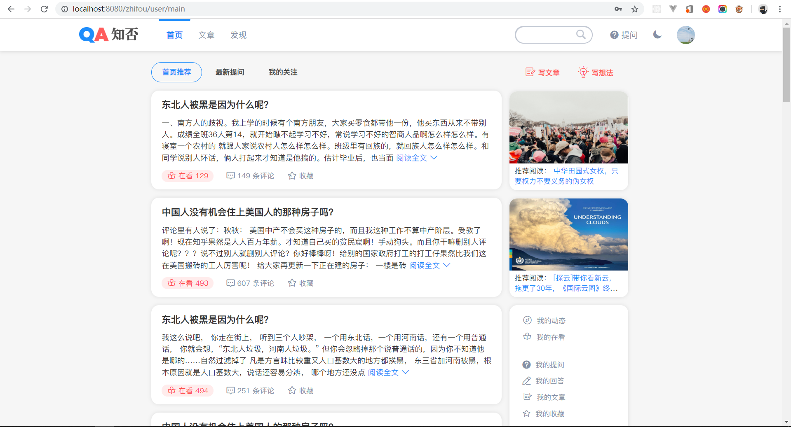
*首页的questionCard有在看、评论、收藏功能，与用户个人主页信息绑定，ps：默认显示160个字，可点击阅读全文进行全文阅读*

- **首页 点击在看👇**

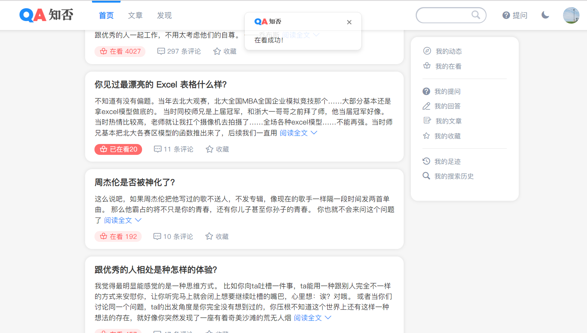

- **首页 评论✍**

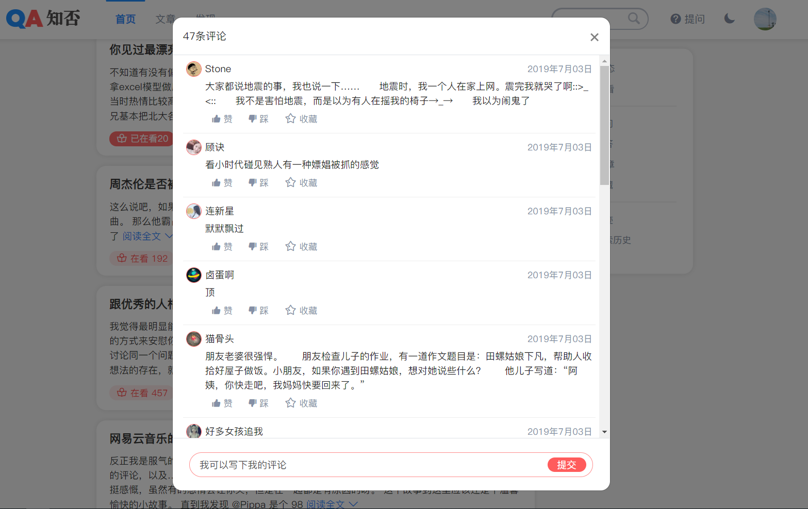

- **首页 的最新提问板块💬**

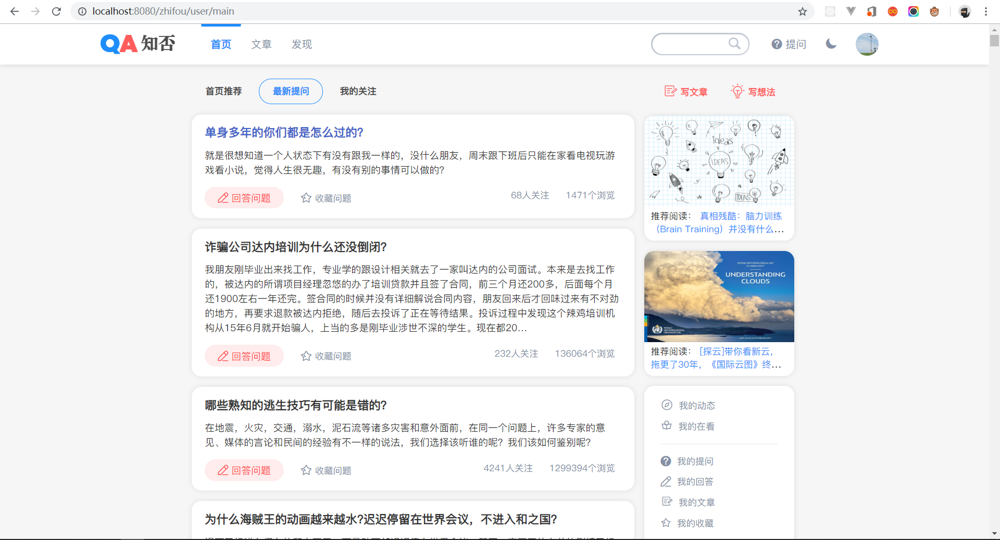

- **文章板块 ——作为网站内容的多样化补充✨**

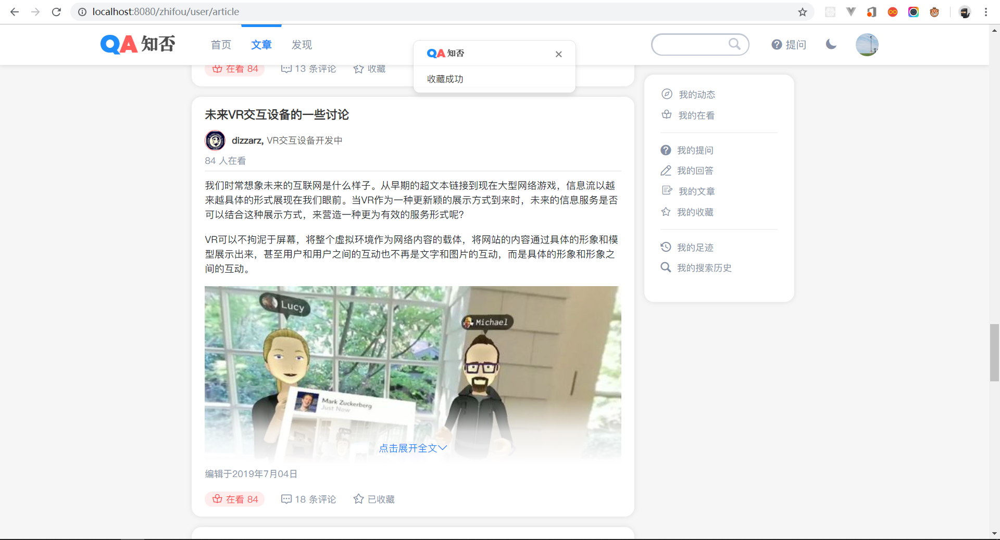

- **文章板块 ——文章详情页面🍔**

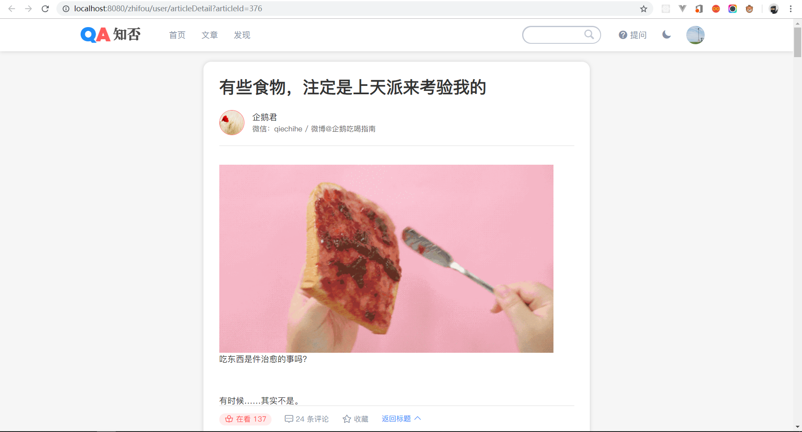

- **文章板块 ——底部评论分页的细节**

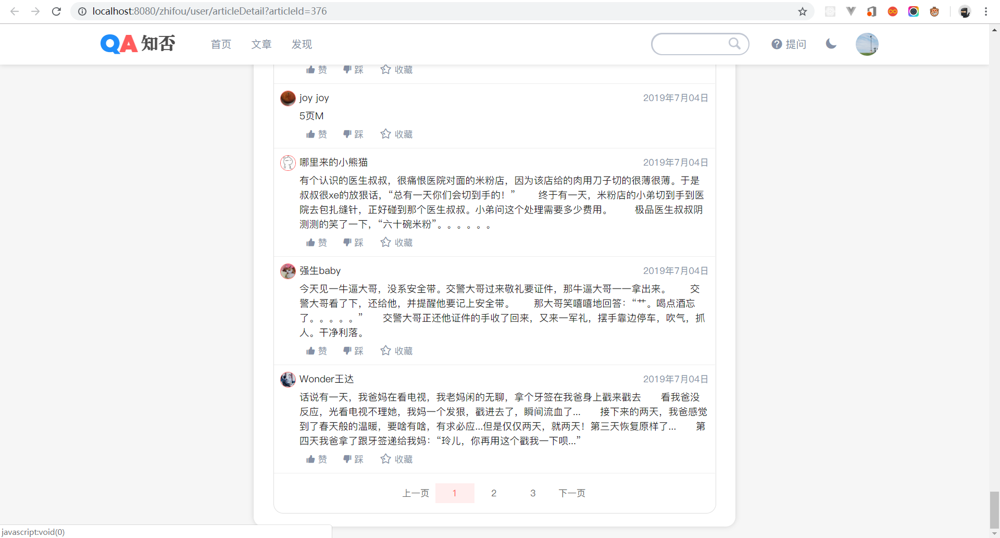

- **写文章功能模块🎨**

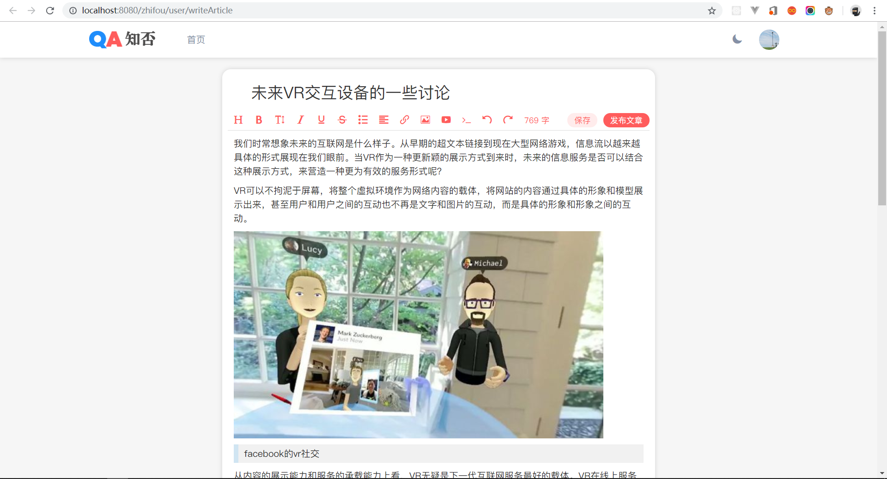
*写文章模块引入了一个开源的轻量级web富文本框插件，支持基础的编辑功能*

- **提问功能模块**

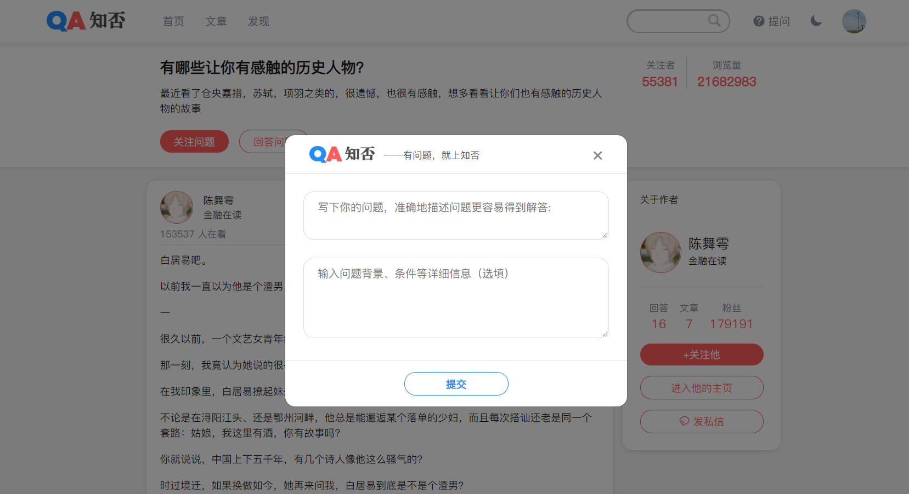

- **个人设置板块**

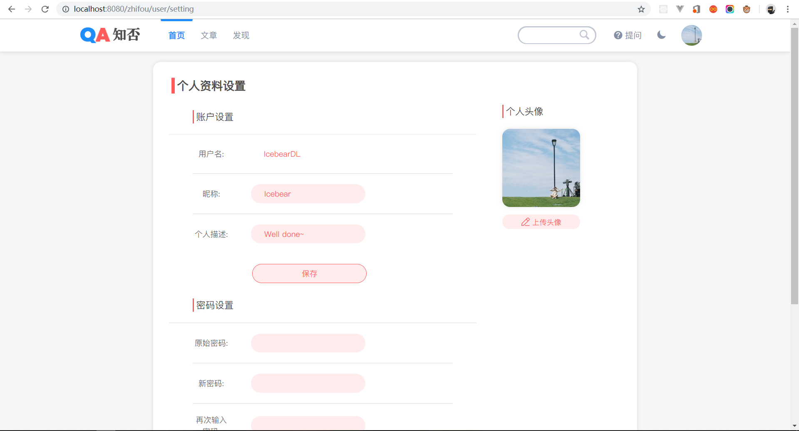

- **个人主页🧑**

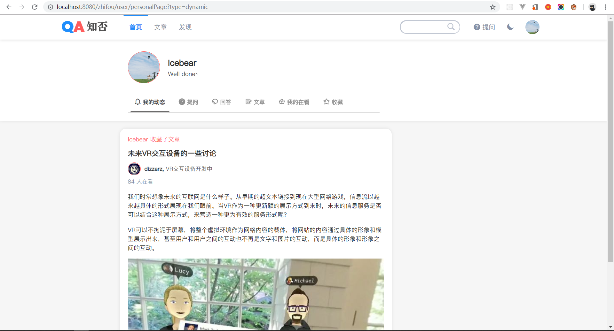
*个人主页集成了所有的用户信息，包括已经点赞或收藏的提问，回答，文章，评论的内容等，并将这些集成到了我的动态，也有用户写过的文章，是用户的个性化页面*

- **亮点：夜晚阅读模式**

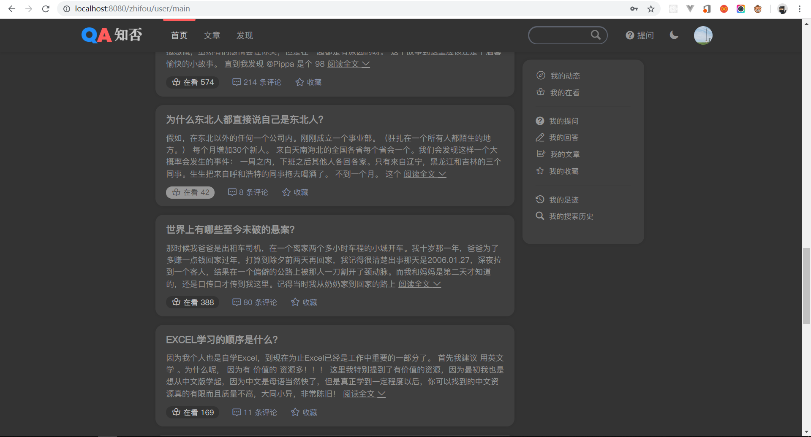
*项目做到一半突发奇想，便重新整理了css文件，添加了网页夜晚阅读模式*

## 个人总结🏀
 - 本次项目整体UI我比较满意，基本上算是自己原创风格，想做的年轻化，但又不至于失去了阅读类网站内容是主体的本质。
 - 使用原生js写法全面提升了我的编码技巧，以后应该多尝试框架编码。
 - 前后端的工作协调交互让我体会到前后端分离的重要性，以及全栈程序猿的重要性，一名合格的前端工程狮应该是不依赖于后端进度的。
 - 最后，代码在中间重构了一次之后赶进度，后面的代码臃肿，亢余，可维护性，扩展性查，这是需要提高的；需要找个时间将前端迁移到React并重构。
